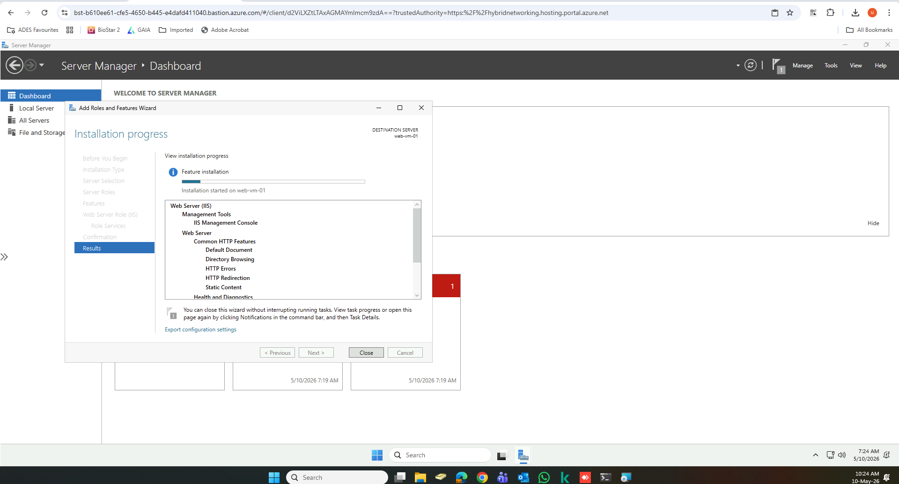
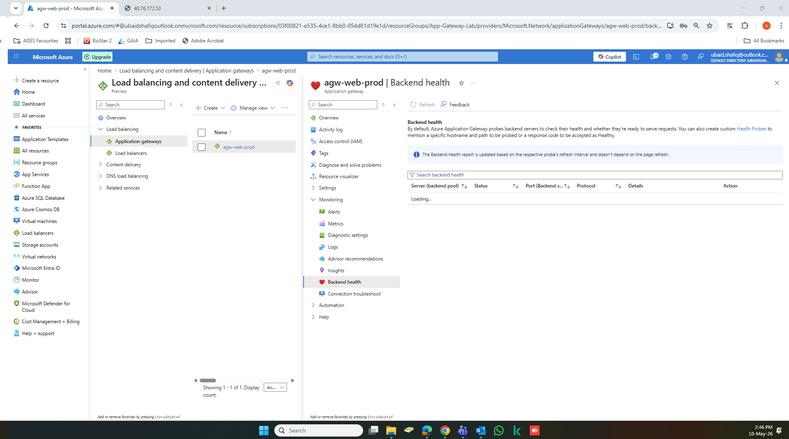

# Azure Load Balancing & Traffic Distribution Architecture

This repository contains my configuration steps, rule validation, and architectural design logic for managing traffic across multi-tier applications in Microsoft Azure.

---

## 🌐 Lab 1: Layer 7 Application-Aware Routing (Application Gateway)
* **Objective:** Securely route HTTP/HTTPS web traffic based on incoming URL paths and protect the frontend web tier.
* **Key Implementations:** * Deployed an Azure Application Gateway using the **WAF v2 SKU** to enforce Layer 7 deep packet inspection.
  * Configured the Web Application Firewall in **Prevention Mode** to actively block and drop common vulnerabilities (SQL Injection, Cross-Site Scripting) before traffic hits the backend.
  * Managed SSL/TLS termination to offload decryption overhead from backend Virtual Machines.

---

## 🔒 Lab 2: Layer 4 Internal & Public Traffic Distribution (Azure Load Balancer)
* **Objective:** High-availability balancing for TCP/UDP workloads while keeping internal backend layers isolated from the public internet.
* **Key Implementations:**
  * **Public Load Balancer:** Configured with a public-facing Frontend IP to distribute external internet connections evenly onto the application web nodes.
  * **Internal Load Balancer (ILB):** Set up a strictly hidden load balancer using a private VNet IP address (`10.x.x.x`) to distribute internal database queries across backend SQL VM clusters, maintaining a strict network security boundary.

